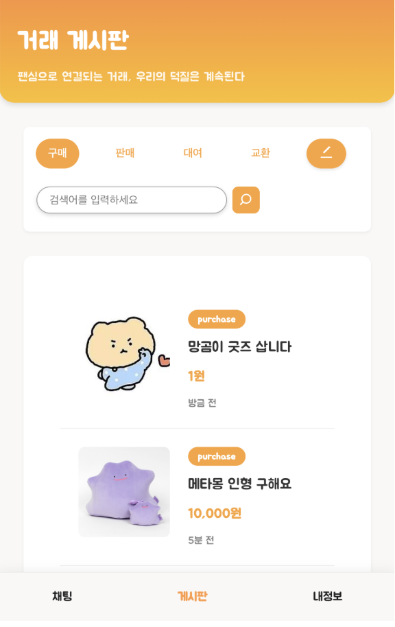
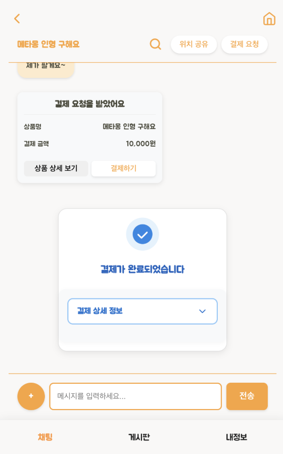
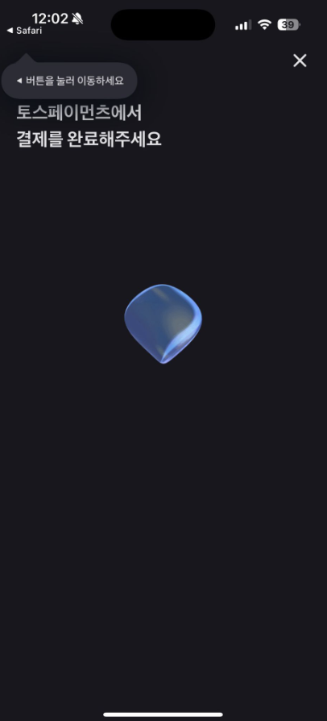
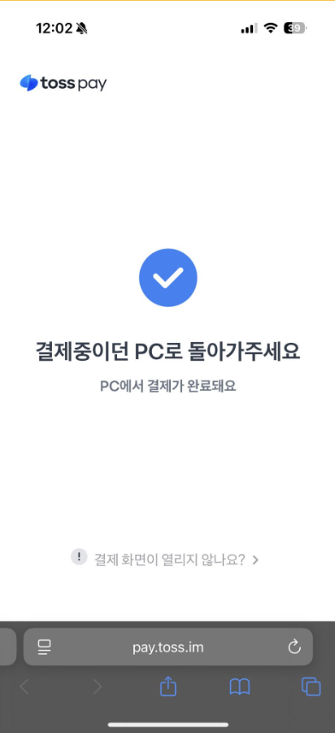
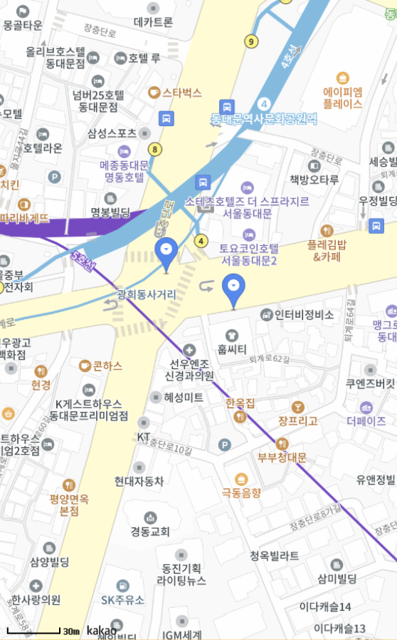
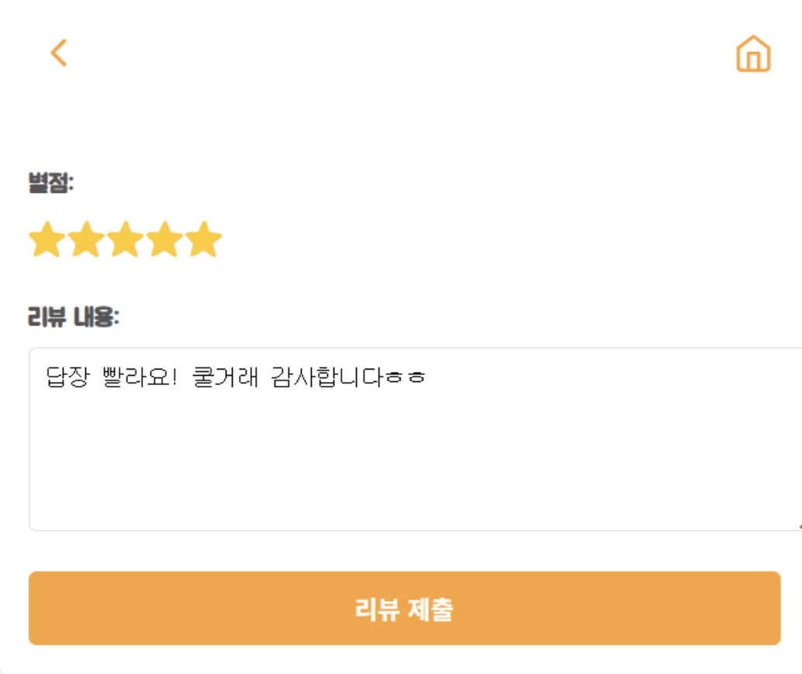
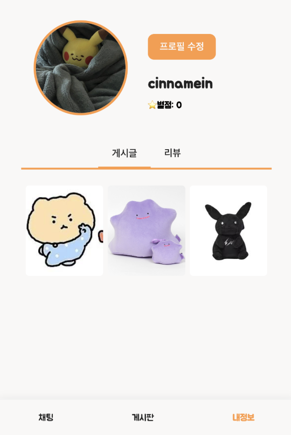
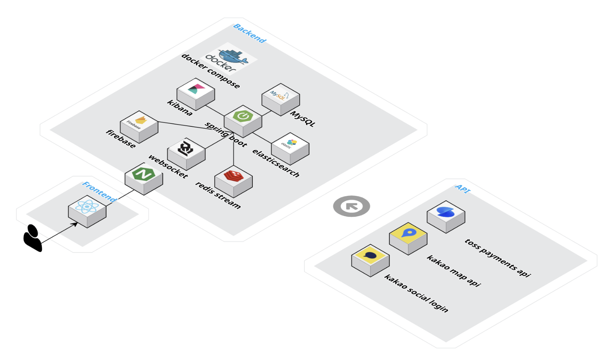

# 🐥 덕행
> 굿즈 관리부터 커뮤니티까지 덕질은 **덕행** 하나로.

## 📣 프로젝트 소개

**덕행(Dukhaeng)** 은 팬 활동에 필요한 모든 기능을 하나의 서비스로 통합한 올인원 플랫폼입니다.
굿즈 거래, 커뮤니티 등 팬덤 문화 속 다양한 니즈를 충족하여 팬 문화의 활성화를 목표로 합니다.

## 👩‍💻 팀원 소개

| 이름 | GitHub |
| - | - |
| 🐱 박상연 | [박상연의 GitHub](https://github.com/ysang989) |
| 🐶 박유민 | [박유민의 GitHub](https://github.com/yumin1209) |
| 🐹 윤채민 | [윤채민의 GitHub](https://github.com/cinnamein) |
| 🐨 전유영 | [전유영의 GitHub](https://github.com/Azamman327) |


## 🌟 서비스 기능

| 기능 | 설명 | 담당자 |
| - | - | - |
| 🔐 **로그인 / 회원가입** | 카카오 등 소셜 계정을 통한 간편한 회원 시스템 | 윤채민 |
| 📝 **게시글 관리** | 사진과 함께 물품 정보를 업로드하여 거래 게시글 등록 | 박상연 |
| 🔍 **물품 검색** | 게시글 제목을 기반으로 빠른 물품 검색 가능 | 박유민 |
| 💳 **TOSS 결제 연동** | 마음에 드는 굿즈를 안전하게 결제 | 박유민 |
| 💬 **실시간 채팅** | 판매자와 1:1 채팅으로 실시간 소통 | 전유영 |
| ⚠️ **사기 메시지 탐지** | 채팅 내용을 자동 분석하여 의심 메시지 경고 | 전유영 |
| 👤 **프로필 관리** | 사용자 정보, 거래글, 리뷰를 확인할 수 있는 페이지 | 윤채민 |
| 🗺️ **위치 공유** | 직거래를 위한 위치 정보 지도 공유 기능 제공 | 전유영 |

## 🎥 미리보기

### 🔐 로그인, 회원가입

<div style="text-align: left;">
<br/>
소셜 로그인 기능
</div>

### 📝 게시글 업로드

<div style="text-align: left;">

<br/>
게시글 등록 및 상세 조회 기능
</div>


### 🔍 물품 검색

<div style="text-align: left;">

<br/>
게시글 제목 기반 검색 기능
</div>

### 💳 TOSS 결제 연동

<div style="text-align: left;">



<br/>
채팅방 내 실시간 TOSS 결제 기능
</div>

### 💬 실시간 채팅

<div style="text-align: left;">

<br/>
1:1 실시간 채팅 기능 (WebSocket 기반)
</div>

### 🗺️ 위치 공유

<div style="text-align: left;">

<br/>
실시간 위치 공유 기능 (Kakao 지도 API)
</div>

### 🌟 리뷰 작성

<div style="text-align: left;">
<br/>
거래 완료 후 리뷰 작성 기능
</div>

### 👤 프로필 관리

<div style="text-align: left;">

<br/>
사용자 프로필, 게시글 및 리뷰 관리 기능
</div>

## 🚀 실행 방법
 
### 사전 요구사항
 
- Docker & Docker Compose
- Node.js 18+
- Java 21
 
### 환경 설정
 
프로젝트 루트에 `.env` 파일을 생성합니다:
 
```env
# MySQL
MYSQL_DATABASE=mydb
MYSQL_USER=user
MYSQL_PASSWORD=password
MYSQL_HOST_PORT=3306
 
# Redis
REDIS_PORT=6379
 
# Elasticsearch
ELASTIC_PORT=9200
ES_JAVA_OPTS=-Xms512m -Xmx512m
 
# Kibana
KIBANA_PORT=5601
 
# JWT
JWT_SECRET=your-secret-key-at-least-32-characters
ACCESS_TOKEN_VALIDITY_IN_MILLISECONDS=3600000
REFRESH_TOKEN_VALIDITY_IN_MILLISECONDS=1209600000
 
# Kakao OAuth
KAKAO_CLIENT_ID=your-kakao-client-id
KAKAO_CLIENT_SECRET=your-kakao-client-secret
 
# Payment (Toss)
PAYMENT_SECRET_KEY=your-toss-secret-key
 
# Firebase
FIREBASE_CONFIGURATION_FILE=firebase-config.json
FIREBASE_BUCKET=your-bucket-name.firebasestorage.app
```
 
Firebase 서비스 계정 키 파일을 `backend/src/main/resources/firebase-config.json`에 배치합니다.
 
### 실행
 
```bash
# 프론트엔드 의존성 설치
cd frontend && npm install && cd ..
 
# 백엔드 빌드
cd backend && ./gradlew bootJar && cd ..
 
# Docker Compose 실행
docker compose up -d
 
# 확인
docker compose ps
```
 
`http://localhost` 으로 접속하여 서비스를 이용할 수 있습니다.

## 🛠 기술 스택

| 구분 | 사용 기술 |
| - | - |
| **Backend** | Spring Boot, Java, WebSocket |
| **Frontend** | React, JavaScript |
| **Database** | MySQL, Redis, Elasticsearch |
| **Infra / DevOps** | Docker, Nginx, Firebase Storage |
| **API** | TOSS 결제 API, Kakao 소셜 로그인, Kakao Maps API |

## 🏗️ 시스템 아키텍처

 
## ⚡ 성능 최적화
 
k6 부하 테스트(유저 50명, 게시글 5,000건, 리뷰 2,000건, 최대 200 VU)를 통해 백엔드 성능을 측정하고 개선했습니다.
 
### 발견된 문제 및 개선
 
#### 1. MyPageService — N+1 쿼리 제거
 
마이페이지에서 유저의 게시글을 조회할 때, 게시글마다 동일한 User를 반복 조회하는 N+1 문제를 발견했습니다.
 
```
Before: 게시글 100개 → DB 쿼리 101회 (1 + N)
After:  게시글 100개 → DB 쿼리 2회 (고정)  → 98% 감소
```
 
#### 2. SellBoardService — 불필요한 쿼리 제거
 
판매 게시글 목록 조회 시, 결과에 사용하지 않는 User 정보를 매번 조회하는 Dead Query를 제거했습니다.
 
```
Before: 페이지당 쿼리 41회 (1 + 20 sell + 20 user)
After:  페이지당 쿼리 21회 (1 + 20 sell)  → 49% 감소
```
 
#### 3. BoardEntity — DB 인덱스 추가
 
게시글 조회에 자주 사용되는 `boardType`, `authorUuid`, `createdAt` 컬럼에 복합 인덱스를 추가하여 Full Table Scan을 Index Range Scan으로 전환했습니다.
 
#### 4. ReviewUseCase — @Transactional 적용
 
리뷰 작성 시 트랜잭션이 없어 데이터 불일치가 발생할 수 있는 문제를 해결했습니다.
 
### 부하 테스트 결과
 
| API | Before avg | After avg | Before p95 | After p95 |
| - | - | - | - | - |
| 게시글 목록 | 6.22ms | 6.64ms | 12.35ms | 13.01ms |
| 게시글 상세 | 2.68ms | 3.05ms | 4.78ms | 5.32ms |
| 마이페이지 | 17.84ms | 18.56ms | 26.49ms | 27.61ms |
| 리뷰 목록 | 27.00ms | 26.39ms | 32.99ms | 33.01ms |
| 검색 | 3.20ms | 3.20ms | 6.19ms | 5.87ms |
 
> 현재 데이터 규모(5,000건)에서는 응답시간 차이가 미미하지만, 핵심은 **DB 쿼리 수 감소**입니다. N+1 쿼리는 O(N)에서 O(1)으로 개선되어, 데이터가 증가할수록 성능 격차가 선형적으로 벌어지는 구조적 개선입니다.
 
| 유저당 게시글 수 | Before 쿼리 | After 쿼리 | 감소율 |
| - | - | - | - |
| 100개 | 101 | 2 | 98% |
| 500개 | 501 | 2 | 99.6% |
| 1,000개 | 1,001 | 2 | 99.8% |
 
> 상세 분석 보고서: [performance-report.md](performance-report.md)
 